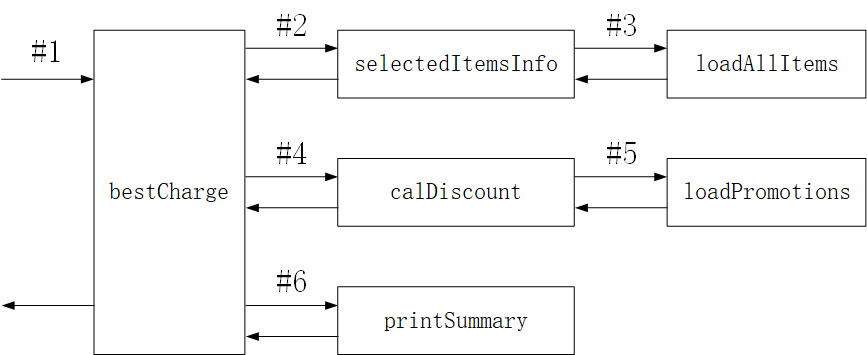

# 【热身作业】入职前培训训练营

网址：[思特沃克学习平台](https://school.thoughtworks.cn/) /训练营中心/[热身作业]入职前培训训练营

时间：2019年1月～2019年2月31号

## 第一周

### Markdown

参考资料：

- [Cmd Markdown 简明语法手册](https://www.zybuluo.com/mdeditor?url=https://www.zybuluo.com/static/editor/md-help.markdown)

- [git - 简明指南](http://rogerdudler.github.io/git-guide/index.zh.html)

工具：

- markdown编辑器：[typora](https://typora.io/)

作业：

- [Markdown&Git](./homework/homework1.md)

  

## 第二周

### HTML

参考资料：

- [W3School上的HTML基础教程](http://www.w3school.com.cn/html/index.asp)
- [HTML新特性](http://www.w3school.com.cn/html5/index.asp)

工具：

- HTML编辑器：[Notepad](https://notepad-plus-plus.org/)

- HTML在线验证(附其他验证工具)：<https://www.freeformatter.com/html-validator.html>
- HTML在线格式化代码(附其他格式化工具)：<https://www.cleancss.com/html-beautify/>

知识点：

- ul与ol之间的区别？ul无序列表；ol有序列表。
- div与span之间的区别？div是块级元素，用于定义文档中的分区或节；span是内联元素，用来组合文档中的行内元素。

作业：

- [HTML](./homework/homework2_1.html)

### CSS

参考资料：

- CSS基础教程：<http://www.w3school.com.cn/css/index.asp>
- CSS布局：<http://learnlayout.com/>

工具：

- CSS编辑器：[Notepad](https://notepad-plus-plus.org/)

- CSS在线验证(附其他验证工具)：<https://codebeautify.org/cssvalidate>

作业：

- [CSS作业](./homework/homework2_2.html)

### HTML&CSS[optional]

## 第三周

### TDD-出租车计价

参考资料：

- [深度解读 - TDD（测试驱动开发）](https://www.jianshu.com/p/62f16cd4fef3)
- [TDD开发演示视频](https://www.bilibili.com/video/av9208705/)

工具：

- IDE： [WebStorm](https://www.jetbrains.com/webstorm/)
- 开发语言：JavaScript

作业：

- [TDD-出租车计价](./homework/homework3) 

## 第四周

### Tasking-任务分解

参考资料：

- [编程的精进之法](https://www.zybuluo.com/jtong/note/504192)

工具：

- IDE： [WebStorm](https://www.jetbrains.com/webstorm/)
- 开发语言：JavaScript

管道图：

作业：

- [黄焖鸡](./homework/homework4_1)

### Pos 机 v1

参考资料：

工具：

作业：